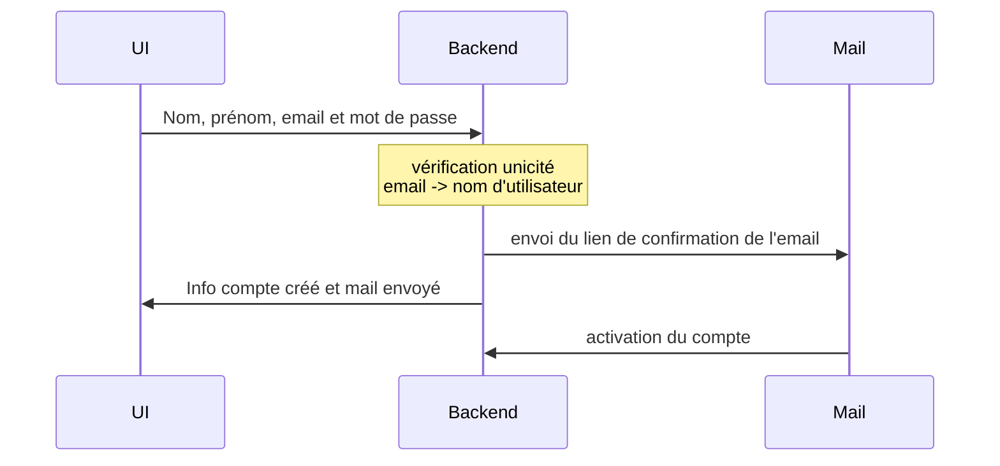
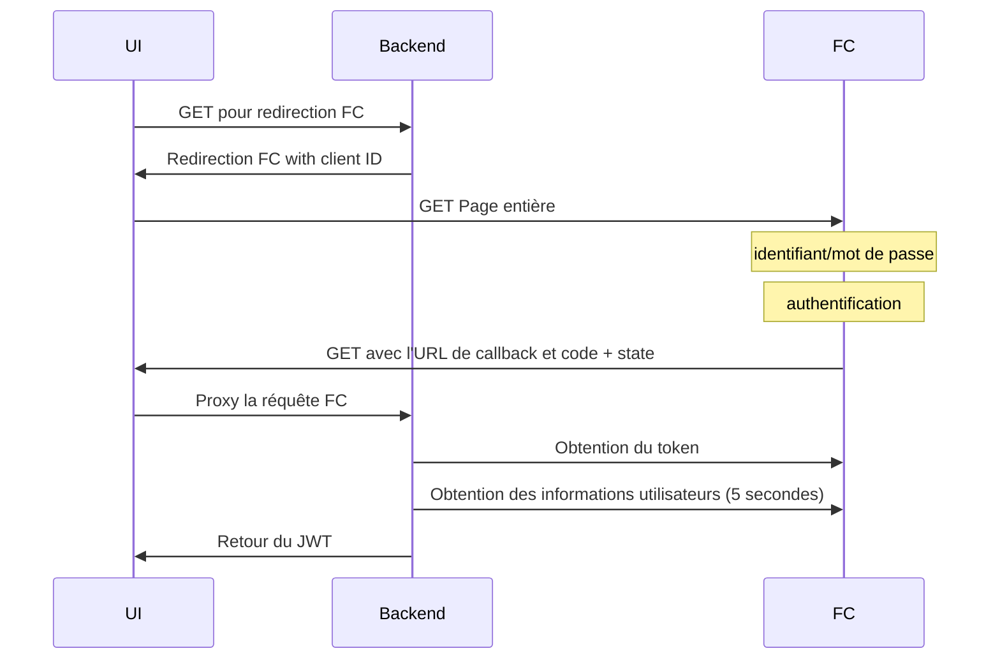

# Authentification

## Introduction

Cette documentation décrit les différents workflows de l'application autour de
l'authentification :

- création de compte (interne à A Dock)
- identification via France Connect
- récupération de mot de passe
- association d'un utilisateur comme titulaire d'une fiche transporteur

L'application A Dock offre deux méthodes d'identification soit via les comptes
utilisateurs internes à l'application ou via France Connect. Une fois que
l'utilisateur est identifié via France Connect, un compte utilisateur interne
sans mot de passe est créé dans l'application A Dock. Le modèle de données
des utilisateurs permet de distinguer la source du compte (A Dock ou France
Connect) et de stocker des informations propres à France Connect dans un champ
JSONB en base de données.

## Création de compte

Il est uniquement de possible de créer un compte propre à A Dock.

L'interface offre un point d'accès au formulaire via la vue de connexion
« Créer un compte ».



## Authenfication via France Connect

Les paramètres de développement de `adock-api` utilisent les URL France
Connect de la plateforme d'intégration.

La plateforme d'intégration doit être en mesure d'accéder à l'application UI
de développement locale pour appeller le callback en HTTPS. Le port doit
être exporté via ngrok ou serveo, etc (par ex. `ssh -R 80:localhost:8000 serveo.net`). Le nom de domaine fournit devra ensuite être utilisé dans le
settings :

```
yarn serve --public https://illis.serveo.net
```

il faut aussi définir le domaine autorisé dans le fichier
`vue.config.js` :

```javascript
module.exports = {
  productionSourceMap: true,
  devServer: {
    allowedHosts: [".serveo.net"]
  }
};
```

L'utilisateur `123-4567` avec le mot de passe `dupont` peut être utilisé sinon
La plateforme d'intégration de France Connect permet de créer des jeu de données
utilisateur via le formulaire
https://fip1.integ01.dev-franceconnect.fr/user/create.
L'identifiant et le mot de passe pourront ensuite être utilisés avec les
fournisseurs d'identité Ameli et impots.gouv.fr.

Le nom de domaine doit être ajouté au settings `CORS` de
l'application serveur dans le fichier `settings_local.py` (ainsi que
`ALLOWED_HOSTS` si l'instance ne fonctionne pas en mode débogage) pour que l'UI
puisse accéder _localement_ au serveur (il n'est pas nécessaire d'écouter les IP
publiques).

L'adresse de callback `https://illi.serveo.net/fc/callback/` doit être connue de
France Connect et renseignée dans
https://partenaires.franceconnect.gouv.fr/monprojet/edition/<votreprojet>/


